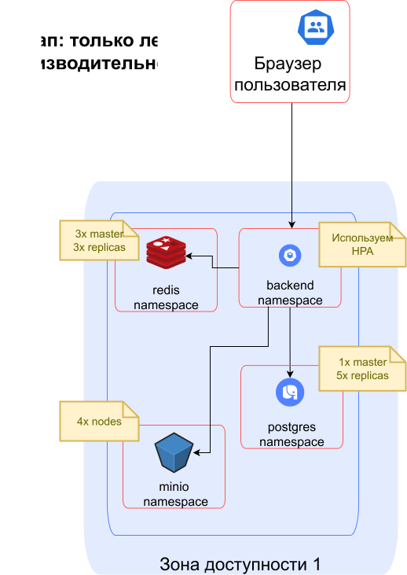
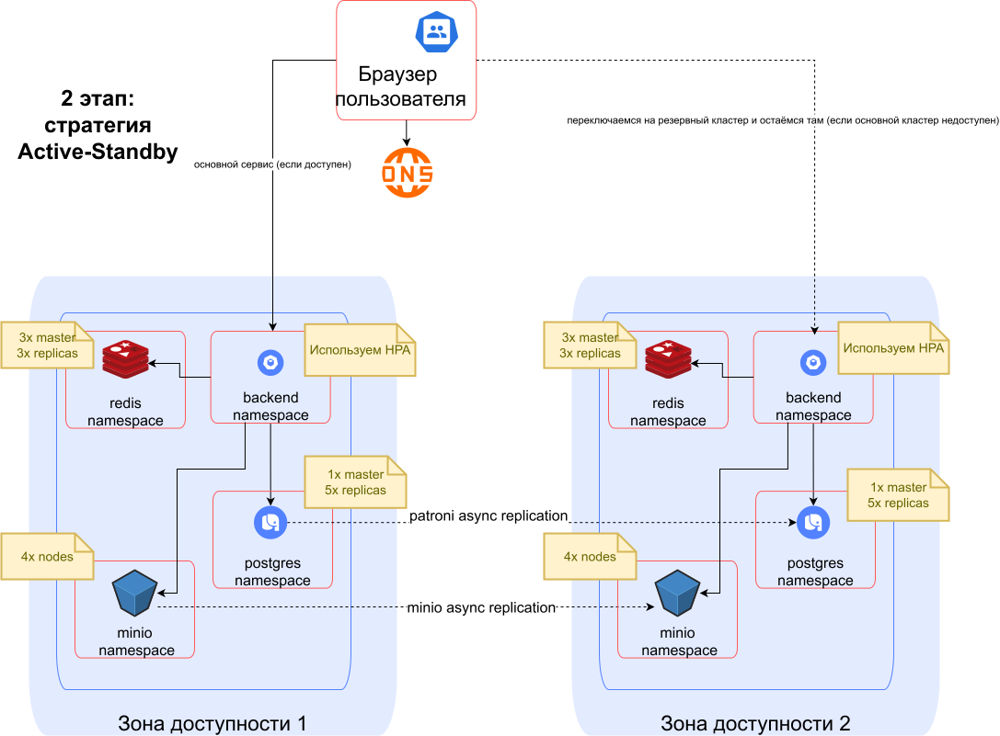

# 1. Проектирование технологической архитектуры

## Контекст

Главная проблема сейчас – низкая производительность нашей системы как таковой, из\-за чего мы не выдерживаем даже текущей нагрузки, не говоря уже об ожидаемой.

В ближайшем будущем ожидается существенный прирост пользователей.

Пинг от МСК до Владивостока сейчас – около 150 мс, что для наших целей терпимо (особенно если статика будет кэшироваться в браузере и [в геораспределённом CDN](https://selectel.ru/services/additional/cdn)).

Опасность выхода дата-центра из строя – считаем невысокой, но учитывать её на перспективу всё равно нужно.

Отдельный риск: при синхронизации данных через Postgres Patroni “архитектор” боится провалить производительность при синхронной репликации данных. И очень боится получить рассогласования данных при асинхронной репликации.

### Дополнительные ограничения

* Хороших российских GLSB с proximity-based name resolution я не нашёл, хотя честно искал.  
* Насчёт хороших российских гео-DNS с возможностью задать различные IP для разных регионов пока тоже не всё понятно: вроде бы [есть у edgecenter.ru,](http://edgecenter.ru) но это не точно (не проверял).  
* Навыками мультикластерного развёртывания приложений “девопс-команда” в моём лице не располагает, стандартных инструментов по администрированию мультикластерных окружений я тоже толком не знаю.  
* Навыками развёртывания растянутых Kubernetes-кластеров я не обладаю, насколько серьёзно надо соблюдать рекомендации – неизвестно.  
* С postgres patroni я ранее не работал.  
* Отчаянно хочется жить ))

## Предлагаемое решение

Предлагаемое решение – делать в 3 этапа.

* Первый этап – делаем всё в рамках одного дата-центра **(главные проблемы с производительностью решаются тут\!)**.  
* Второй этап – делаем active-standby-репликацию на случай выхода основного дата-центра из строя.  
* Третий этап – это уже амбиция: арендуем сервера в Новосибирске и на Дальнем Востоке – и делаем active-active-систему.

### Первый этап

_1 этап: всё в одной зоне доступности_

* Разделяем postgres на master \+ replicas (основной поток запросов на чтение отныне будет из реплик), для этого используем [helm chart postgres от bitnami](https://artifacthub.io/packages/helm/bitnami/postgresql), потом заменим на что-нибудь, что поддерживается).  
* Добавляем Redis для кэширования HTTP-ответов и запросов к БД (в кэш ходит бэкэнд-приложение).  
* Разделяем core-app на 2 отдельных микросервиса (теперь core-app не обрабтатывает страховку сам, а только создаёт событие InsuranceOrderCreated и ждёт его обработки, пока – через запросы к Redis):  
* core-app:  
  * отображает данные о страховых продуктах, доступных клиенту;  
  * отображает данные о страховках, которые клиент уже заключил;  
  * принимает заказ на покупку новой страховки (пока синхронно):  
    * пишет в БД, что заявка создана;  
    * создаёт событие InsuranceOrderCreated и отправляет в очередь необработанынх заявок;  
    * опрашивает Redis раз в 1 секунду, не появилась ли там запись о том, что заявка обработана (считаем, что Redis быстрый);  
    * как только запись в Redis появилась – возвращает ответ (положительный или отрицательный), если запись не появилась через 1 минуту – возвращает ответ об ошибке.  
* ins-purchaser (обработчик, который служит только для обработки заказов на страховки):  
  * запускается в во многих экземплярах;  
  * работает как competing consumer с возможностью повторной отправки события в очередь;  
    * при успехе – делает запись в БД и в Redis-кэш и отправляет в выходной топик событие, что событие обработано успешно;  
    * если не удалось обработать в течение 30 секунд с начала создания (или если страховая ответила твёрдым отказом) – тоже делаем запись в БД и в Redis-кэш и тоже отправляем в выходной топик событие, что страховку создать не удалось;  
    * если возникла ошибка при обработке (например, при обрыве связи со страховой), то делаем rescheduling события-заявки в очередь.  
* Подключаем Redis Streams в качестве очереди.  
* Выносим раздачу статики на отдельный сервис, используем imgproxy, настраиваем кэширование статики в браузере.  
* Используем Selectel CDN для кэширования статики (у них, в отличие от “Яндекса”, обещают точки присутствия на Дальнем Востоке).  
* Для хранения статики используем S3.  
* Включаем Rate Limiting по всем основным эндпоинтам, (отдельно для всего кластера, отдельно для конкретных подов, чтобы не перегрузить наши инстансы бэкэнда).  
* Здесь же – включаем централизованный сбор логов (ELK) и метрик (Prometheus \+ Grafana), а также подключаем OTel-трассировку, т.к. у нас уже EDA и очереди, и без неё нам очень плохо.

### Второй этап (Active-Standby)

_2 этап: Active-Standby_

* Поднимаем второй Kuberenetes-кластер в другой зоне доступности (тоже в центральной России).  
* Используем postgres patroni для поддержки репликации между разными ДЦ, настраиваем репликацию (асинхронную).  
* Настраиваем одностороннюю репликацию данных S3 из основного в резервный кластер (описание есть [по ссылке,](https://blog.min.io/minio-multi-site-active-active-replication/%20) там про active-active, но мы по факту не будем писать на второй ДЦ до падения первого).  
* Примерно в это же время – реализуем сервисы для продажи ОСАГО (из следующих заданий).  
* Налаживаем синхронизацию данных по ElasticSearch, Prometheus и Jaeger.

### Третий этап (амбиция на перспективу): пытаемся в Active-Active

_3 этап: Active-Standby_

Здесь нам предстоит наладить работу нашего бэкэнда на нескольких кластерах одновременно.

Этот этап нужно прорабатывать заранее, так как здесь мне видится несколько потенциальных точек отказа, которые нужно прототипировать (проверять на уровне proof-of-concept).

Скорее всего, производительность при синхронной репликации нас не устроит, так что нас ждёт проверка, что асинхронная репликация данных работает корректно и не даёт рассогласований данных, особенно в БД сервисе информации о клиенте.

Кроме того, нужно обязательно протестировать, что у нас корректно работает синхронизация данных и между S3 на разных кластерах.

Вероятно, нам понадобится дополнительные правки в бэкэнде и миграция схем данных: как минимум, заменить все id с автоинкрементом на UUID \= )

Возможно, нам понадобится вообще переехать с Postgres на какую-то другую БД, но скорее всего обойдётся.

## Риски и недостатки выбранного решения

* Достаточно долгий общий срок реализации (ориентировочно – в районе года).  
* Долгое время живём на одной зоне доступности.

## Рассмотренные альтернативы

### Отложить логи, метрики и телеметрию на 2-й этап

И так попытаться сэкономить время. Но:

* Prometheus нам всё равно нужен, хотя бы для HPA по RPS.  
* Без телеметрии нам тоже плохо, как только начинается асинхронная обработка задач (а она начинается уже на 1-м этапе).  
* И даже ELK нам тоже нужен уже на 1-м этапе, ибо очень помогает отлаживаться, и тем сокращает общие сроки разработки.

### Не делать Active-Standby, cразу делать Active-Active

Главная проблема – это проблема синхронизации данных между кластерами, особенно синхронизация данных в Postgres. Пока у нас одновременно активен только один кластер, у нас одновременно работает только один источник изменений, который и выступает как единственный “источник правды”.

Соответственно, на втором этапе мы достаточно быстро и безболезненно получим запасной кластер (на случай, если основной кластер на время отвалится), но погружаться в проблематику рассогласования данных при асинхронной репликации нам ещё не придётся. И у нас будет время, чтобы нормально протестировать сценарии, при которых возможно рассогласование при Active-Active.

### Попытаться использовать Stretched Kubernetes Cluster

Готового решения по Stretched Cluster с зонами доступности на ДВ я для России не нашёл. А если попытаться сделать самим, то в интернетах пишут, что Stretched Kubernetes Cluster требует очень быстрого пинга между зонами доступности (150 миллисекунд уже не подойдёт)

\> «applying a request should normally take fewer than 50 milliseconds.» [etcd](https://etcd.io/docs/v3.4/faq/)

\> «a network latency smaller than 10 ms round-trip time must be ensured at all times.» [IBM](https://www.ibm.com/docs/en/rhocp-ibm-z?topic=ihadr-stretching-red-hat-openshift-cluster-across-availability-zones)

Потому – увы ((