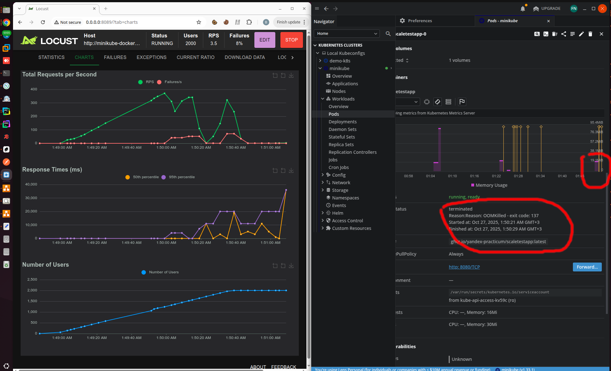
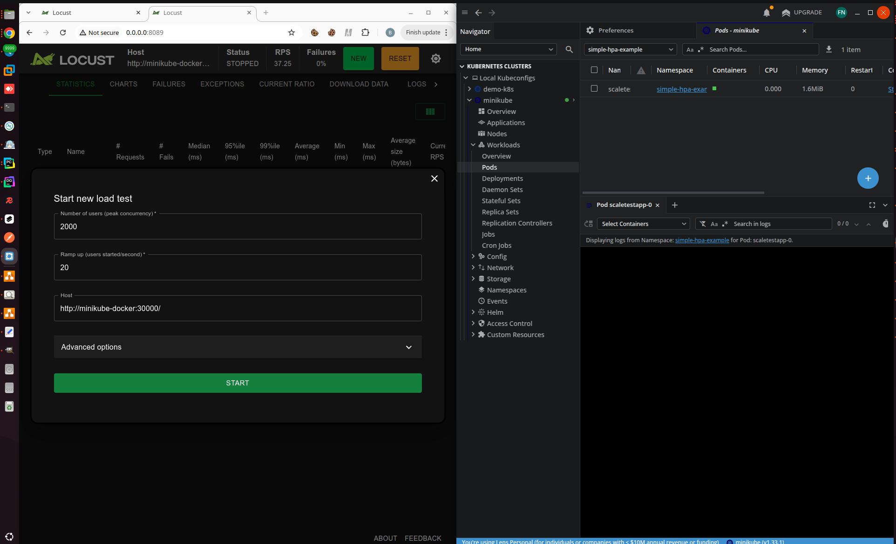
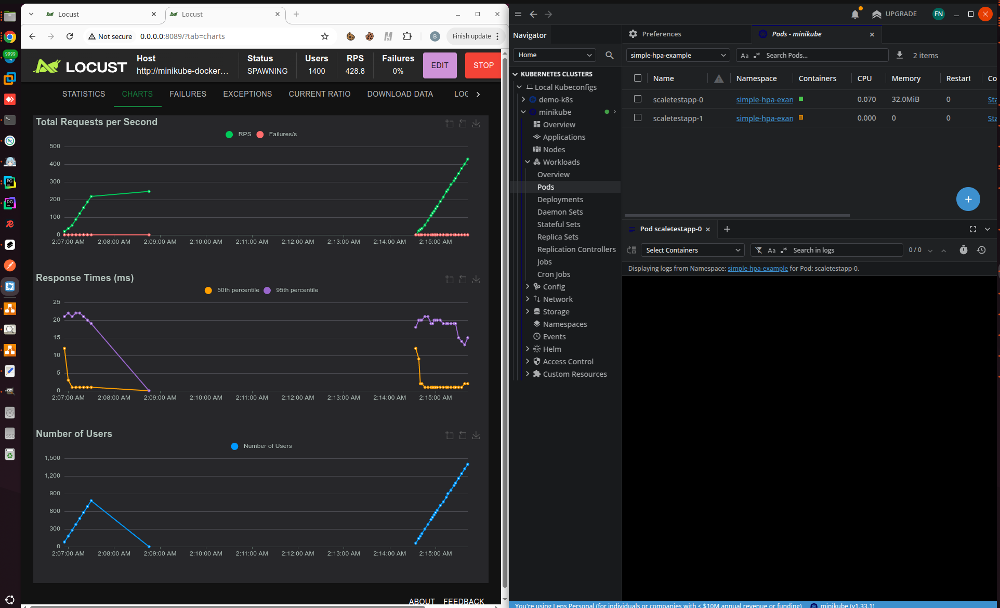
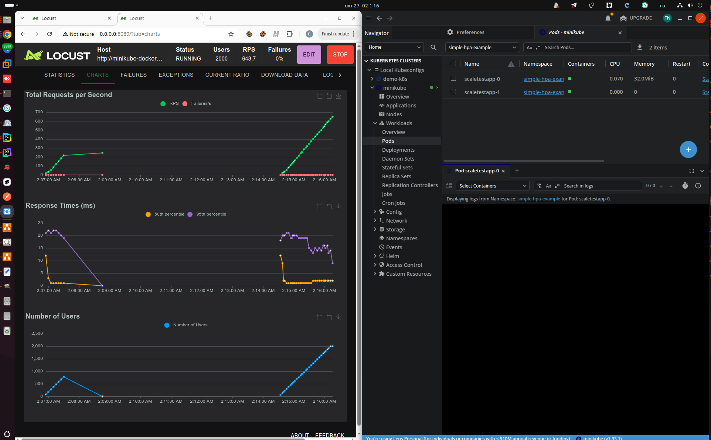
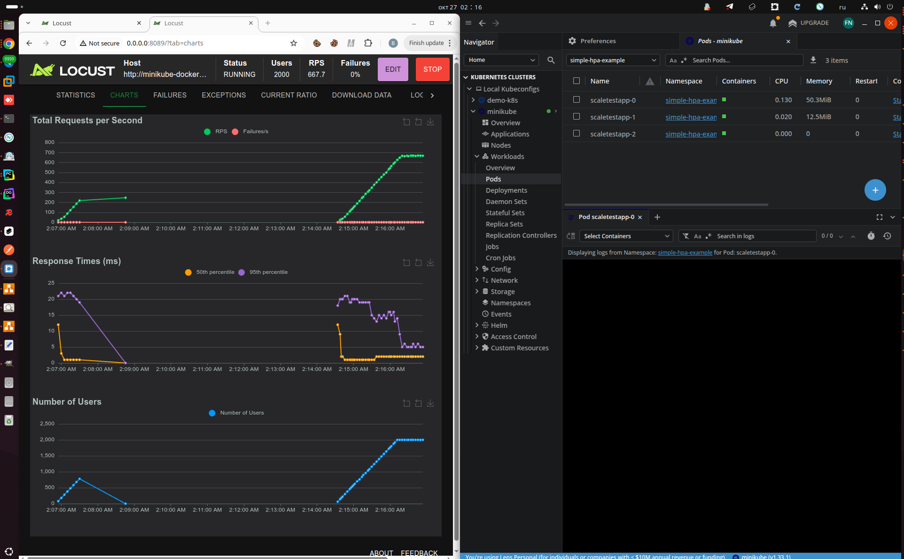
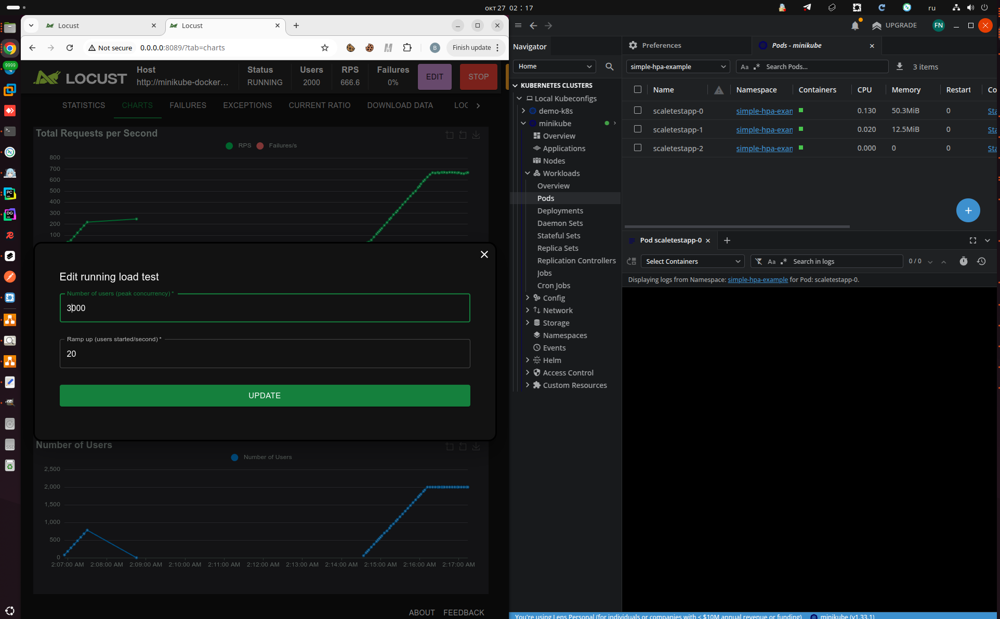
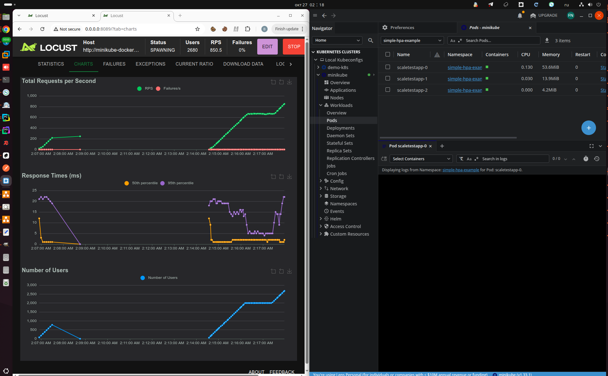
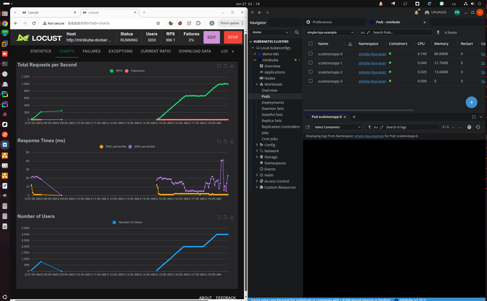

# 2.1. Динамическое масштабирование на основании показателей утилизации памяти

Здесь мы сделаем простенький HPA (по потреблению памяти), LoadBalancer будет доступен по `$(minikube ip):3000`

# Что где лежит?

- **[simple-hpa-example.yaml](simple-hpa-example.yaml)** — основной манифест с Headless Service, LoadBalancer Service (NodePort 30000), StatefulSet приложения `scaletestapp` и HorizontalPodAutoscaler по метрике памяти (цель 24Mi, лимит 64Mi).
- **[install.sh](install.sh)** — скрипт установки: создаёт namespace `simple-hpa-example` и применяет манифест `simple-hpa-example.yaml`.
- **[uninstall.sh](uninstall.sh)** — удаляет ресурсы из манифеста, но оставляет namespace.
- **[delete_namespace.sh](delete_namespace.sh)** — полностью удаляет namespace `simple-hpa-example` со всеми ресурсами.
- **[../setup_minikube.sh](../setup_minikube.sh)** — настройка minikube с 8 CPU, 32GB RAM, включением metrics-server, ingress, istio и других аддонов.
- **[../locustfile.py](../locustfile.py)** — простой Locust-сценарий для нагрузочного тестирования: GET-запросы на `/` с интервалом 1–5 секунд.

## Первая попытка протестироваться
В первый раз я выставил целевое потребление памяти в HPA в 24Mi (как по заданию), и жёсткий лимит памяти в `30Mi`.

С самим бэкэнд-приложением `scaletestapp` ситуация примерно такая:
- оно успевает обрабатывать 300 RPS (время отклика -- единицы миллисекунд, потребление памяти -- мегабайты);
- примерно на 350 RPS у него начинает **резко и значительно** расти время отклика (до 1-2 секунд) и одновременно потребление памяти (десятки мегабайт, как он внутри запоминает неотвеченные запросы, я не знаю, но выглядит логично).

При этом есть одна тонкость.
- HPA по умолчанию работает с интервалом в 15 секунд, но Kubernetes Metrics Server по умолчанию будет собирать метрики раз в 60 секунд, так что реальное время срабатывания HPA будет 60 секунд.
- А вот проверку, что под не вышел за пределы по памяти, Kubernetes будет делать при каждом выделении памяти. И OOM Killer отработает мгновенно. 

Учитывая, что потребление памяти у нас может расти очень быстро, как только `scaletestapp` начнёт захлёбываться -- с такими жёсткими лимитами мы почти всегда будем уходить в перезагрузку по OOM ещё до того, как HPA успеет отработать.

_Под точно перезагружался по OOM, но metrics server так и не обнаружил, что потребление памяти превысило 30 Mb ))_

## Вторая попытка, с лимитом памяти в 64 Мб:

_Настройки Locust: 2000 юзеров, hatch ratio 20._

_Новый под #1..._

_Новый под #2_ 

_Выставляем ещё юзеров в Locust..._

_И ещё один под, на этом уровне оно и будет болтаться дальше..._

P.S. По идее, можно правильно настроить Metrics Server в minikube, и смотреть память он станет чаще, но это уже в следующий раз = )