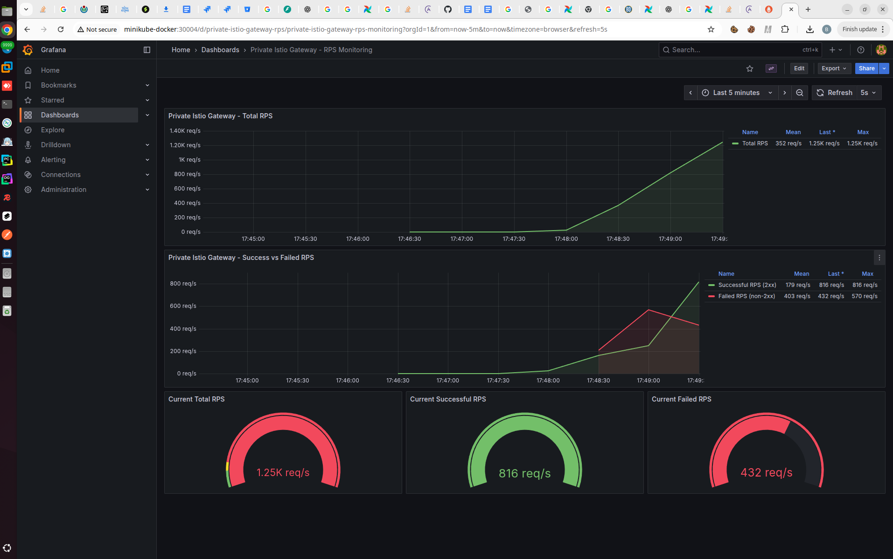
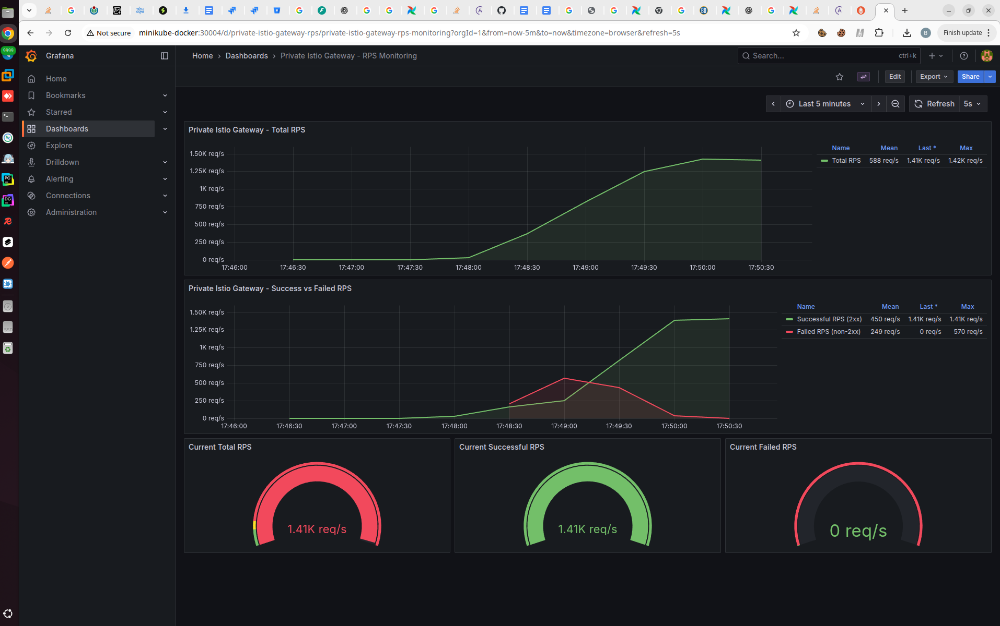
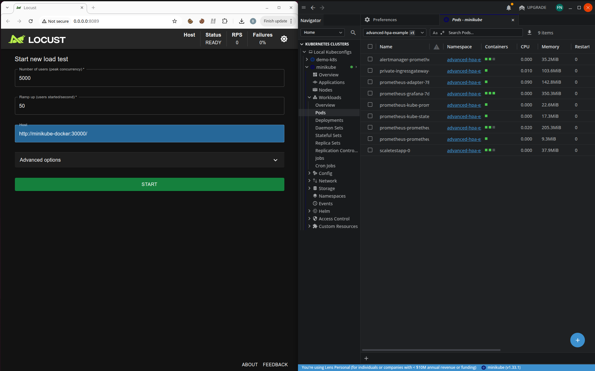
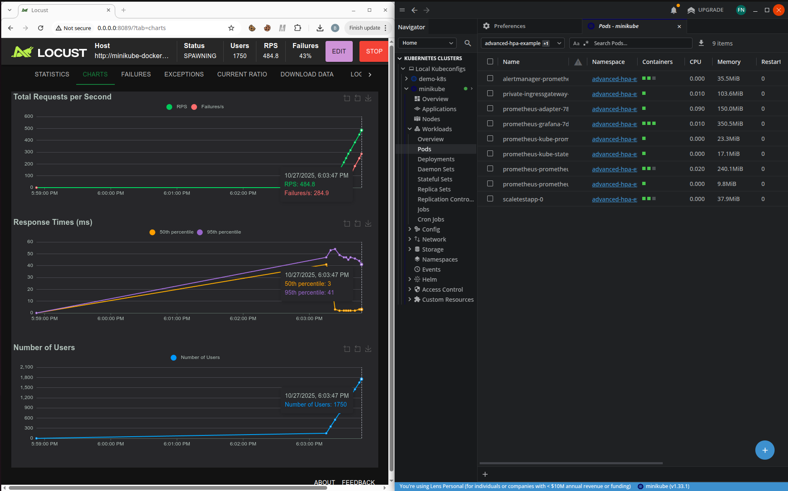
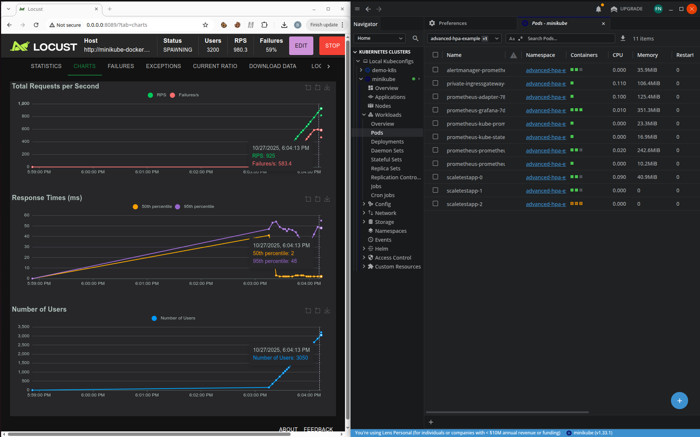
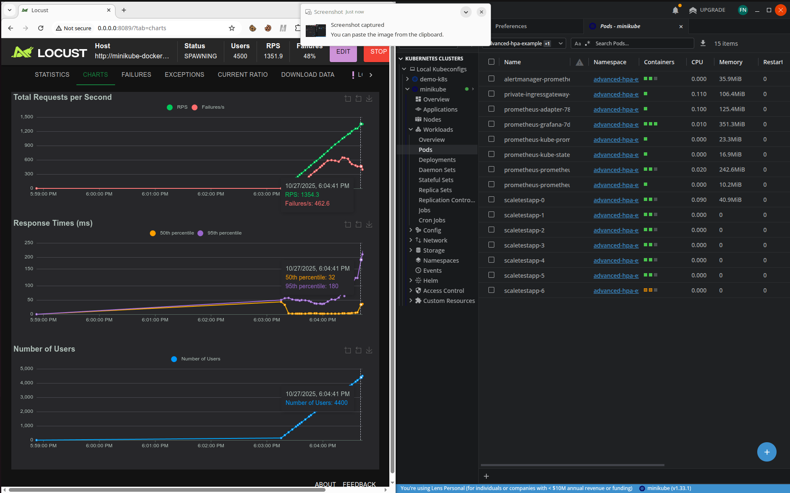
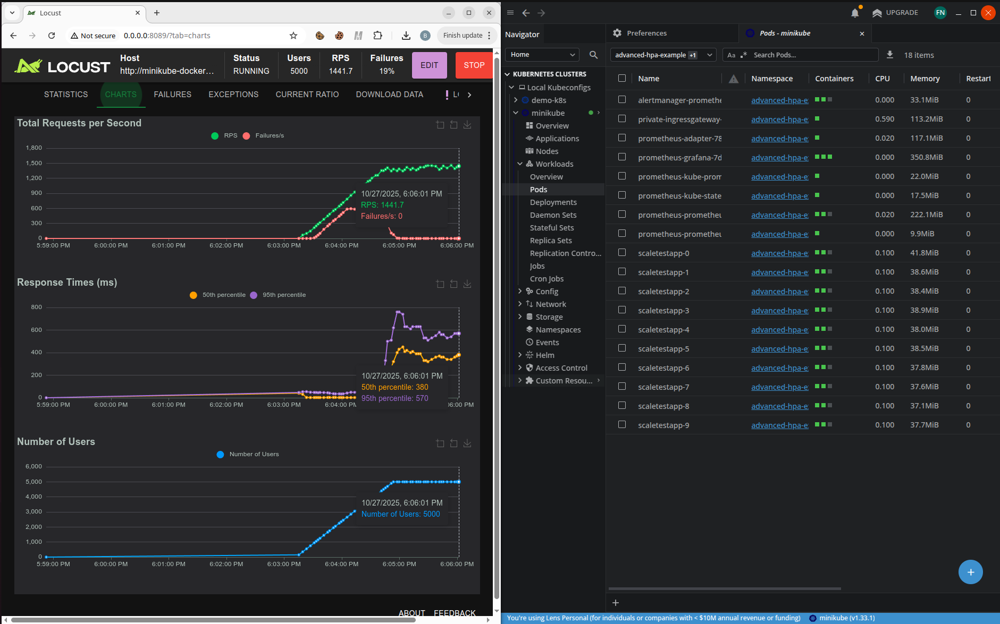

# 2.2. Динамическое горизонтальное масштабирование на основании количества запросов в секунду

Здесь мы сделали HPA покруче: на основе RPS (целевое RPS взяли в 150 RPS на под), собирая метрики с помощью prometheus-adapter.

А кроме того -- врубили istio и сделали крутой трюк в виде ограничения RPS для каждого пода в нашем StatefulSet (до 200 RPS) через модификацию Envoy Sidecar Proxy.
Что интересно, даже удалось вытащить частный IngressGateway в отдельный NodePort 30000, через него мы и будем тестироваться (чуть позже).

## Что где лежит?

- **[`dynamic-hpa-example.yaml`](./dynamic-hpa-example.yaml)** — StatefulSet приложения, HPA по кастомной метрике, Istio IngressGateway и Envoy rate limiting.
- **[`monitoring-bundle.yaml`](./monitoring-bundle.yaml)** — ConfigMap с values для Prometheus Adapter, `ServiceMonitor`, отладочные NodePort-сервисы для доступа извне к Prometheus (порт `30003`) и Grafana (порт `30004`), а также Grafana Dashboard для мониторинга RPS частного Istio Gateway.
- **[`install.sh`](./install.sh)** — Полная установка мониторинга, Prometheus Adapter и приложения; автоматически применяет `monitoring-bundle.yaml`.
- **[`uninstall.sh`](./uninstall.sh)** — Обратный скрипт удаления, очищает все ресурсы из `monitoring-bundle.yaml` и Helm-релизы.
- **[`locustfile.py`](./locustfile.py)** — locustfile для нагрузочного тестирования.

## Доступ к мониторингу

После установки доступны:

- **Prometheus**: `http://<minikube-ip>:30003`
- **Grafana**: `http://<minikube-ip>:30004`
  - Логин: `admin`
  - Пароль: `prom-operator`

### Grafana Dashboard для Istio Gateway

Дашборд **"Private Istio Gateway - RPS Monitoring"** автоматически загружается при установке и показывает:

- **Total RPS** — общий RPS через частный Istio IngressGateway
- **Successful RPS (2xx)** — успешные запросы (коды ответа 2xx)
- **Failed RPS (non-2xx)** — неуспешные запросы (коды ответа не 2xx, включая 429 при rate limiting)

**Как открыть дашборд:**
1. Откройте Grafana: `http://<minikube-ip>:30004`
2. Войдите с credentials выше
3. Перейдите: **Dashboards → Browse → Private Istio Gateway - RPS Monitoring**
4. Или прямая ссылка: `http://<minikube-ip>:30004/d/private-istio-gateway-rps`

## Тестирование-1

_Дашборд Grafana, здесь нагрузка в Locust уже выросла, но поды ещё создаются_

_Дашборд Grafana после того, как новые поды уже созданы_

Пожалуй, поставим интервал измерений RPS в Prometheus на 30 секунд...

## Тестирование-2

_Настройки locust (выставляем пожёстче) и начальное состояние кластера..._

_Ушли за 200 RPS, сработало ограничение RPS на поды scaletestapp (новые поды ещё не создались)_

_Появляются новые поды, количество ошибок снижается_

_Все поды создались, ошибки исчезли_